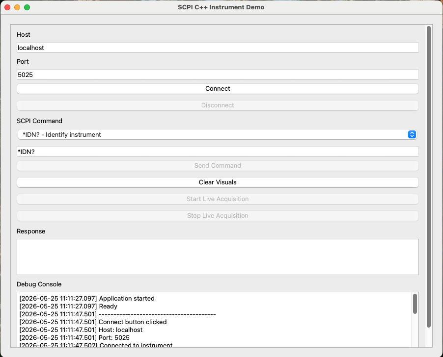
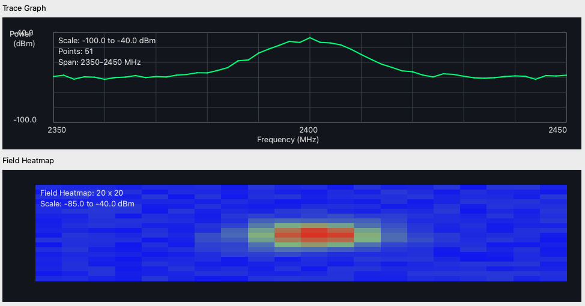
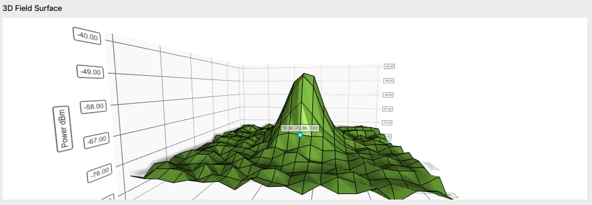
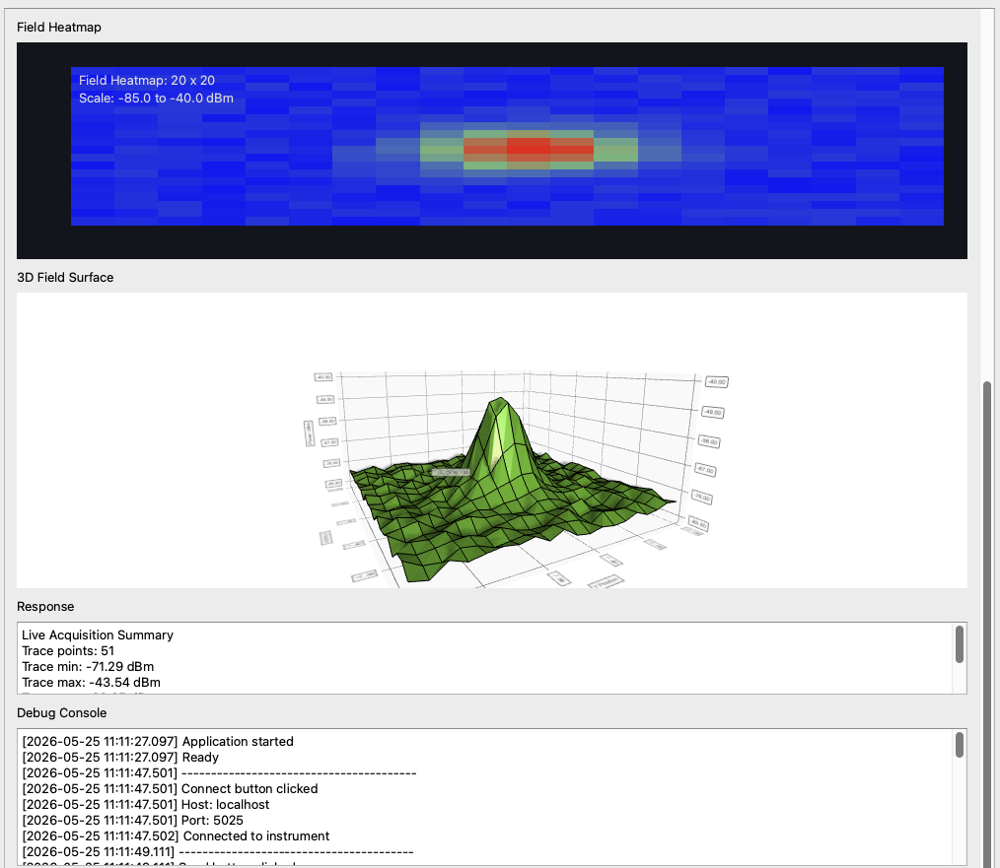

# SCPI C++ Instrument Demo

Modular C++ instrument-control prototype using SCPI over TCP/IP sockets with live Qt visualization and a Python mock spectrum-analyzer simulator.

## Features

- SCPI TCP communication
- Modular transport layer
- Qt6 desktop GUI
- Live acquisition
- 1D trace visualization
- 2D RF heatmap
- 3D RF surface mapping
- Mock Python SCPI instrument
- Linux + Windows CI builds

## Screenshots

### Main Dashboard



### Trace + Field Mapping



### 3D RF Surface



### SCPI Response / Console



---

## Architecture

```text
Qt GUI / CLI
      ↓
ScpiClient
      ↓
ITransport
      ↓
TcpTransport
      ↓
TCP Socket
      ↓
Mock SCPI Instrument
```

---

## Project Structure

```text
core/       SCPI logic and parsing
transport/  Transport abstraction and TCP implementation
qt-ui/      Qt GUI and visualization widgets
ui/         CLI interface
mock/       Python SCPI instrument simulator
scripts/    Build/configure scripts
```

---

## Build

Clean:

```bash
./scripts/clean.sh
```

Configure:

```bash
./scripts/configure_qt.sh
```

Build:

```bash
./scripts/build.sh
```

Outputs:

```text
build/scpi_cpp_demo
build/scpi_cpp_qt_demo
```

---

## Run Mock Instrument

```bash
python3 mock/mock_scpi_server.py
```

Default:
- Host: localhost
- Port: 5025

---

## Run CLI Demo

```bash
./build/scpi_cpp_demo localhost 5025 "*IDN?"
```

---

## Run Qt GUI

```bash
./build/scpi_cpp_qt_demo
```

Example commands:
- `*IDN?`
- `:MEAS:VOLT?`
- `:TRAC:DATA?`
- `:FIELD:GRID?`

---


## Notes

- Developed on Apple Silicon macOS
- Cross-platform CMake/Qt project
- Linux + Windows CI builds via GitHub Actions

## Apple Silicon Homebrew Note

If macOS uses the wrong Homebrew/Qt path, run:

```bash
source ./scripts/use_arm_brew.sh
```

Expected:

```text
/opt/homebrew/bin/brew
```